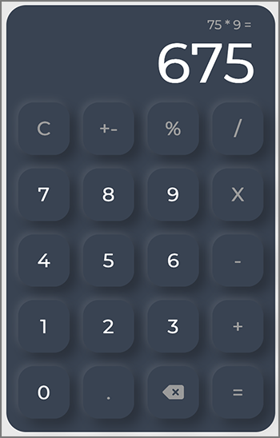

# Basic Calculator
This is a basic calculator built in React.

## Technologies
React, CSS

## Features
- Perform basic calculator functionalities
- Display immediate history so the user can see what numbers and operation were used to calculate the result
- Keyboard hotkey integration - the user can use keyboard keys (on the home row) to use the calculator
- Custom, responsive CSS design

## Screenshot

## Working Demo
[Click here to see a working demo](https://buckleupstudios.com/resources/react/calculator/)
